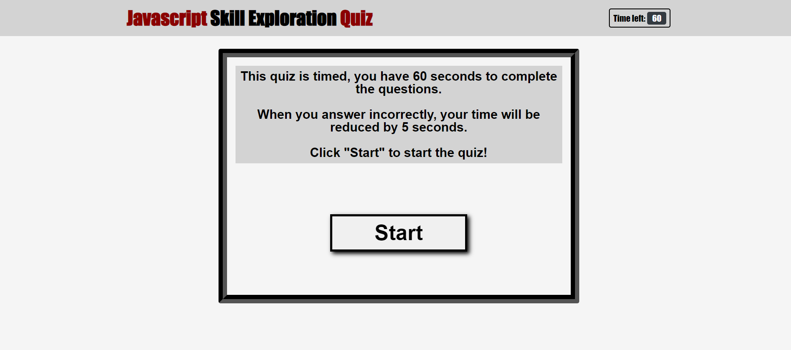

# Exploration-Quiz

## Description

- My motivation for this application was to code a functioning quiz to test javascript knowledge with 10 questions.
- I wanted to make sure the score felt impactful on each attempt, so you could compare your previous scores.
- This application is a testament of how far I've come already in my ability to code javascript.

## Link to Application

https://mhammy.github.io/exploration-quiz-c4/

## Usage

Click the "Start" button on the page and the quiz will begin. It is timed (starting at 60 seconds) with a penalty of -5 seconds for incorrect answers. 

Your point total at the end of the quiz is based on questions answered correctly and the time you have left. 

When you reach the results page, you have the option to submit your scores to the highscore board.

## Credits

I am the original creator of the code used for this application.

https://www.w3schools.com

https://www.youtube.com/@WebDevSimplified

https://developer.mozilla.org/en-US/

## License

Please refer to the License in the repository.